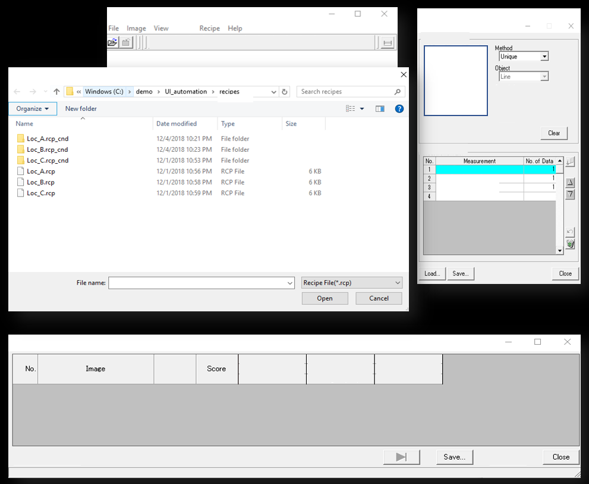

# UI automation using pywinauto

## Introduction

Scripting is a common starting point for automating repetitive tasks.  When neither the source code nor API is available, one may need to utilize UI automation frameworks such as [pywinauto](https://github.com/pywinauto/pywinauto). While writing my own scripts, I have discovered some tricks that may be useful to other users of [pywinauto](https://github.com/pywinauto/pywinauto).  I am sharing workflow.py as an example of driving an application with multiple windows.

## What workflow.py does

I used workflow.py to analyze images using a commercial software.  The script loops over a list of images inside a structured folder, clicks through a series of windows, and write the results into a text file.  Because [pywinauto](https://github.com/pywinauto/pywinauto) does not navigate around the older version of Microsoft Windows File Manager very well, I have moved the active images into a specific folder before each measurement.  Over the course of a few months, this script has saved me at least an hour of drag-and-drop per day.

Below is an example screenshot showing the complexity of UI that can be controlled by [pywinauto](https://github.com/pywinauto/pywinauto).



## Basics

### Starting the application
```
from pywinauto.application import Application
app = Application(backend='uia').start('PATH TO EXE')
```

### Identifying the UI windows and controls
```
dlg = app.window(best_match='MAIN WINDOW NAME')
file_dlg = app.Window_(best_match='Dialog', top_level_only=True).child_window(best_match='Recipe')
close_button = app.Window_(best_match='Dialog', top_level_only=True).child_window(best_match='Recipe').CloseButton2
```

If a control cannot be uniquely identified by its name and control type, use print_control_identifiers() to obtain the auto_id

```
app.Properties.print_control_identifiers()
menu_bar = main_window.child_window(title="Application", auto_id="MenuBar", control_type="MenuBar")
```

## Tips

### Screen resolution
[pywinauto](https://github.com/pywinauto/pywinauto) does depend on screen resolution.  I have discovered this feature the hard way.  I developed and tested the script on a laptop connected to an external monitor, but the script later failed to select an item under the dropdown menu while running on the main laptop display.  It turned out the main laptop screen was scaled by 125%, and the cursor was clicking at the wrong place.  The solution is to turn off screen scaling on windows.

### Nested dropdown menu
Some of the submenus on windows are not drawn on the screen until they are needed, and these submenus are not listed in `print_control_identifiers()`.  To get around this problem, the script clicks on the top-level menu item before selecting an item on the submenu.

```
menu_bar = main_window.child_window(title="Application", auto_id="MenuBar", control_type="MenuBar")
menu_bar.Recipe.click_input()
main_window.menu_select('Recipe->Load Recipe')
```

## Conclusions
In this tutorial, I have shown you the basics and some tips for using [pywinauto](https://github.com/pywinauto/pywinauto).  Happy automation!

## Disclaimer
This tutorial was created for educational purposes only.